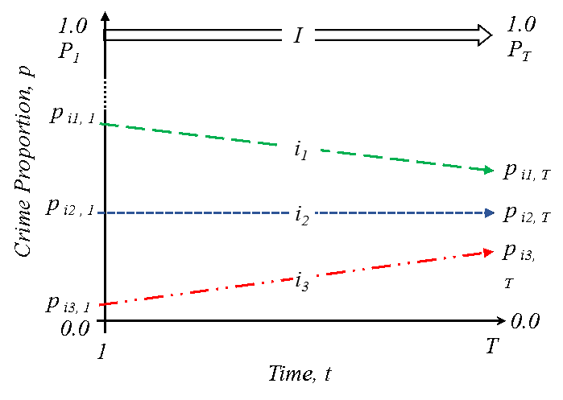
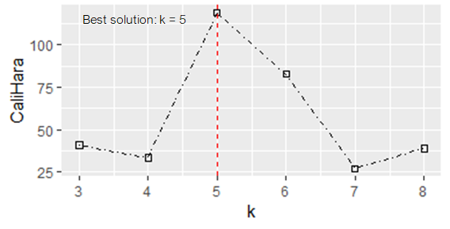
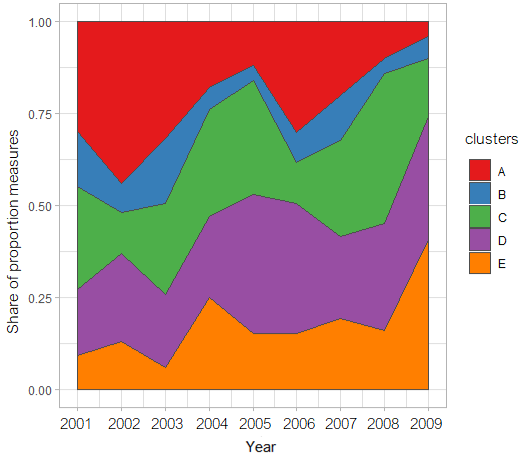

<style type="text/css">

h1.title {
  font-size: 16px;
  color: Black;
  text-align: center;
}

h4.author { /* Header 4 - and the author and data headers use this too  */
    font-size: 18px;
  font-family: "Arial", Times, serif;
  color: Black;
  text-align: center;
}
h4.date { /* Header 4 - and the author and data headers use this too  */
  font-size: 12px;
  font-family: "Arial", Times, serif;
  color: Black;
  text-align: center;
}

h4.abstract { /* Header 4 - and the author and data headers use this too  */
  font-size: 12px;
  font-family: "Arial", Times, serif;
  color: black;
  text-align: center;
}

h4.affiliation{ /* Header 4 - and the author and data headers use this too  */
  font-size: 12px;
  font-family: "Arial", Times, serif;
  color: black;
  text-align: center;
}

body, td {
   font-size: 11px;
}
code.r{
  font-size: 10px;
}
pre {
  font-size: 11px
}
h1 { /* Header 1 */
  font-size: 14px;
  color: DarkBlue;
}
h2 { /* Header 2 */
    font-size: 12px;
  color: DarkBlue;
}
h3 { /* Header 3 */
  font-size: 11px;
  font-family: "Times New Roman", Times, serif;
  color: DarkBlue;

</style>

```{r setup, include = FALSE}
knitr::opts_chunk$set(
  collapse = TRUE,
  comment = "#>"
)
```
# Introduction

The longitudinal clustering analysis is ubiquitous in social and behavioural sciences for investigating the developmental processes of a phenomenon over time. Examples of the commonly used techniques in these areas include the group-based trajectory modelling (GBTM) and the non-parametric kmeans methods. A key feature of these techniques is their high sensitivity to outliers and short-term fluctuations in the trajectories, thereby minimising the power of the techniques to identify long-term linear trends in the data. In crime and place research, for example, the identification of such `long-term` linear trends may help to develop some theoretical understanding of criminal victimisation within a geographical space [@Griffith2004]. In order to address this challenge, we advance a novel technique named `anchored kmedoids` (`akmedoids`) which implements three key modifications to the existing longitudinal `kmeans` approach. First, it approximates trajectories using ordinary least square regression (`OLS`) and second, it `anchors` the initialisation process with median observations. And third, it uses `medoid` observations as new anchors for each iteration of the expectation-maximisation procedure [@Celeux1992]. These modifications ensure that the impacts of short-term fluctuations and outliers are eliminated. By linking the final groupings back to the original trajectories, a clearer delineation of the long-term linear trends of trajectories are obtained.

We provide the `akmedoids` as an open-source package using `R` platform. The goal is to facilitate easy uptake of the package in any field. Leading to the main `clustering` functions are a number of useful `data manipulation` functions for addressing common data issues, such as `missing entries` and extreme `outliers` in a longitudinal dataset. We provided a worked example using a small sample dataset that should allow users to get a clear understanding of the operation of each function. 

#1. Data manipulation
Table \ref{tab:table1} shows the main data manipulation functions and their descriptions. The data manipulation functions is to help prepare data for advance analysis. They also include functions to convert longitudinal data from `count` measure to the `proportion` measure required for the crime inequality investigation. In order to demonstrate the utility of these functions, we provide a simulated dataset `traj` which can be called by typing `traj` in `R` console after loading the `akmedoids` library.

```{r, echo=FALSE, include=FALSE}
require(knitr)
library(flextable)
library(kableExtra)
col1 <- c("1", "2","3","4", "5")
col2 <- c("`dataImputation`","`rates`", "`props`", "`outlierDetect`","`wSpaces`")
col3 <- c("Data imputation for longitudinal data", "Conversion of 'counts' to 'rates'", "Conversion of 'counts' (or 'rates') to 'Proportion'", "Outlier detection and replacement","Whitespace removal")
col4 <- c("Calculates any missing entries (`NA`, `Inf`, `null`) in a longitudinal data, according to a specified method","Calculates rates from observed 'counts' and its associated denominator data", "Converts 'counts' or 'rates' observation to 'proportion'", "Identifies outlier observations in the data, and replace or remove them","Removes all the leading and trailing whitespaces in a longitudinal data")
tble <- data.frame(col1, col2, col3, col4)
tble <- tble
```

```{r table1, results='asis', echo=FALSE, tidy.opts=list(width.cutoff=50)}
knitr::kable(tble, caption = "`Data manipulation` functions", col.names = c("SN","Function","Title","Description")) %>%
  kable_styling(full_width = F) %>%
  column_spec(1, bold = T, border_right = T) %>%
  column_spec(2, width = "8em", background = "white") %>%
  column_spec(3, width = "12em", background = "white") %>%
  column_spec(4, width = "16em", background = "white")#%>%
  #row_spec(3:5, bold = T, color = "white", background = "#D7261E")
```

### (i) `"dataImputation"` functions
This function calculates any missing entries in a data, according to a chosen method. This function recognises three types of data entries as missing, namely `NA`, `Inf`, `null`, with an option to either consider `0` as a missing value or not. Furthermore, the function provide a replacement option for the missing entries, based on two methods. First, an `arithmetic` method which uses the `mean`, `minimum` or `maximum` value from the corresponding rows or columns in which a missing value is located. Second, a `regression` method which uses a linear regression line to estimate the missing values. Using the regression method, only the missing data points derive values from the regression line while the remaining (observed) data points retain their original values. The function terminates if there are trajectories with only one observation. Below is a demonstration of how the `regression` option estimates the missing values using the `traj` dataset. 


```{r, eval=FALSE}

#installing the `akmedoids` packages
install.packages("devtools")
devtools::install_github("manalytics/packages/akmedoids")

```

```{r, eval=TRUE}

#loading the package
library(akmedoids)

```

```{r, eval=TRUE}

#viewing the first 6 rows of 'traj' object
head(traj)

#no. of rows
nrow(traj) 

#no. of columns
ncol(traj) 

```


The first column of the `traj` object is the `id` (unique) field. In many applications, it is necessary to preserve the `id` column in order to allow the linking of outputs to other external datasets. Many of the functions in the `akmedoids` provides an option to recognise the first column of an input dataset as the unique field. The `dataImputation` function can be used to imput the missing data point of `traj` object as follows:


```{r, eval=TRUE}
imp_traj <- dataImputation(traj, id_field = TRUE, method = 2, 
               replace_with = 1, fill_zeros = FALSE)

#viewing the first 6 rows
head(imp_traj)
```

The argument `method = 2` in the function refers to the `regression` technique, while the argument `replace_with = 1` indicate `linear` option (which is currently the only available option for the regression method). Figure \ref{fig:figs1} is a graphical illustration of how the function approximates the missing values for the dataset.


```{r figs1, echo=FALSE, fig.width=6,fig.height=7,fig.align="center", fig.cap="\\label{fig:figs1} data imputation with regression"}

par(mar=c(2,2,2,2)+0.1)
par(adj = 0)
par(mfrow=c(6,2))
dat <- as.data.frame(traj)
t_name <- as.vector(traj[,1])
dat <- dat[,2:ncol(dat)]
#if(k==nrow(dat)){
  #}
#head(dat)
for(k in 1:nrow(dat)){ #k<-2
  y <- suppressWarnings(as.numeric(as.character(dat[k,])))
  x <- 1:length(y)
  known <- data.frame(x, y)
  known_1 <- data.frame(known[is.na(known[,2])|is.infinite(known[,2]),])  #
  known_2 <- data.frame(known[!is.na(known[,2])&!is.infinite(known[,2]),])
  #train the available data using linear regression
  model.lm <- lm(y ~ x, data = known_2)
  # Use predict the y value for the removed data
  newY <- predict(model.lm, newdata = data.frame(x = known_1[,1]))
   l_pred <- predict(model.lm, newdata = data.frame(1:9)) #line
  #add to the original data.
  dat[k, known_1[,1]] <- newY
  #Add the predicted points to the original data
  #dev.new()
  #plot(1:10, col=2)
  plot (known$x, known$y, type="o", main=paste("traj_id:",t_name[k], sep=" "), font.main = 1)
  if(!length(newY)==0){#plot only if it has elements
  lines(l_pred, lty="dotted", col="red", lwd=2)
  }
  points(known_1[,1], newY, col = "red")
}
#point legend
plot_colors <- c("black","red")
text <- c("Observed points", "Predicted points")
plot.new()
par(xpd=TRUE)
legend("center",legend = text, text.width = max(sapply(text, strwidth)),
       col=plot_colors, pch = 1, cex=1, horiz = FALSE)
par(xpd=FALSE)

#line legend
plot_colors <- c("black","red")
text <- c("line joining observed points", "regression line predicting missing points")
plot.new()
par(xpd=TRUE)
legend("center",legend = text, text.width = max(sapply(text, strwidth)),
       col=plot_colors, lwd=1, cex=1, lty=c(1,2), horiz = FALSE)
par(xpd=FALSE)
```


### A special use of '`dataImputation`' function:

Generally, obtaining the denominator information (i.e. population) for non-census years is a difficult task in longitudinal studies. This challenge pose a significant drawback to accurate estimation of measures, such as crime rates and population-at-risk of an infectious disease, across a geographical space. Given a limited number of denominator information, an alternative way of obtaining the missing data points is to interpolate and/or extrapolate the missing population information using the available data points. The `dataImputation` function can be used for perform this task. 

The key step towards using the function for this purpose is to create a matrix (in `Excel`), containing both the available fields and the missing fields arranged in their appropriate order. All the entries of the missing fields can be filled with either `NA` or `null`. An example of this type of problem is demonstrated below with a population data with only two available data fields. The corresponding `input` matrix of the population data is also shown.

```{r, eval=TRUE}

#viewing the data first 6 rows
head(population)

nrow(population) #no. of rows

ncol(population) #no. of columns
```


The corresponding `input` dataset is prepared as follows and saved as `population2`:


```{r, echo=FALSE}
#create a matrix of the same rows and column as the `traj` data
pop <- as.data.frame(matrix(0, nrow(population), ncol(traj)))
colnames(pop) <- names(traj) 
pop[,1] <- as.vector(as.character(population[,1]))
pop[,4] <- as.vector(as.character(population[,2]))
pop[,8] <- as.vector(as.character(population[,3]))
list_ <- c(2, 3, 5, 6, 7, 9, 10)
for(u_ in 1:length(list_)){ #u_<-1
  pop[,list_[u_]] <- "NA"
}

head(pop)

population2 <- pop
```


The missing values are estimated as follows using the `regression` method of the `dataImputation` function: 


```{r, eval=TRUE}

pop_imp_result <- dataImputation(population2, id_field = TRUE, method = 2, 
               replace_with = 1, fill_zeros = FALSE)

#viewing the first 6 rows
head(pop_imp_result)

```


Given that there are only two data points in each row, the `regression` method simply generates the missing values by fitting a straight line to the available data points. In other words, the higher the number of available data points for any trajectory the better the estimation of the missing points. 


###(ii) `"rates"` function
Given a longitudinal data ($m\times n$) and its associated denominator data ($s\times n$), the `rates` function converts the longitudinal data to 'rates' measures (e.g. counts per 100 residents). Both the longitudinal and the denominator data may contain different number of rows, but they must have the same number of columns, and must include the `id` (unique) field in their respective first column. They do not have to be sorted. The output contains only rows whose `id` values match in both data. We demonstrate the utility of this function with the `imp_traj` object (above) and the estimated population data ('`pop_imp_result`'). 


```{r, eval=TRUE}

#example of estimation of 'crimes per 200 residents'
crime_per_200_people <- rates(imp_traj, denomin=pop_imp_result, id_field=TRUE, 
                              multiplier = 200)

#view the full output
crime_per_200_people

#check the number of rows
nrow(crime_per_200_people)

```

It can be observed that the number of rows of the output data is 9. This implies that only 9 `location_ids` match between the two dataset. The unmatched `ids` are ignored. **Note**: the calculation of `rates` often returns output with some of the cell entries having `Inf` and `NA` values due to calculation errors and character inputs in the data. We therefore recommend that users re-run the `dataImputation` function after generating `rates` measures for a large data matrix.


###(iii) `"props"` function {#props}


Given a longitudinal data, the `props` function converts each data point (i.e. entry in each cell) to the proportion of the sum of their corresponding column. Using the `crime_per_200_people` estimates above, we can derive the `proportion of crime per 200 people` for each entry as:  


```{r, eval=TRUE}

#Proportions of crimes per 200 residents
prop_crime_per200_people <- props(crime_per_200_people, id_field = TRUE)

#view the full output
prop_crime_per200_people


#A quick check that sum of each column of proportion measures adds up to 1.  
colSums(prop_crime_per200_people[,2:ncol(prop_crime_per200_people)])


```

As first demonstrated in @Adepeju2019 in their long-term inequality study, we will use this `proportion` measure to demonstrate the main clustering function of this package. 


### (iv) `"outlierDetect"` function
This function is aimed at allowing users to identify any outlier observations in a longitudinal data, and replace or remove them accordingly. The first step to addressing outliers in any data is to first visualise (plot) the data. A user can then decide the cut-off for isolating the outliers. The `outlierDetect` function provides two options for doing this: (`i`) a `quantile` method, while isolate any observation with a value higher than a specified quantile of the values distribution, and (`ii`) a `manual` method, in which a user defines the cut-off value. The '`replace_with`' argument is used to determine whether the outlier value should be replaced with the mean value of the row or the column in which they are located. The user also has the option to simply remove the trajectory that contains the outlier value. In deciding whether a trajectory contains outlier or not, the `count` argument allows the user to set the `horizontal threshold` (i.e. number of outlier values that must detected in a trajectory) in order for the trajectory to be considered as having an outlier observations. Below, we demonstrate the utility of the `outlierDetect` function using the `imp_traj` data above. 


```{r figs2, echo=TRUE, fig.width=8,fig.height=4,fig.align="center", fig.cap="\\label{fig:figs2}, Identifying outliers"}

#Plotting the data using ggplot library
library(ggplot2)
library(reshape2)

#converting the wide data format into stacked format for plotting
imp_traj_long <- melt(imp_traj, id="location_ids") 

#view the first 6 rows
head(imp_traj_long)

#plot function
p <-  ggplot(imp_traj_long, aes(x=variable, y=value,
            group=location_ids, color=location_ids)) + 
            geom_point() + 
            geom_line()

print(p)

```

Figure \ref{fig:figs2} is the output of the above plot function.  

Based on Figure \ref{fig:figs2}, if we assume that observations of `x2001`, `x2007` and `x2008` of trajectory with id `E01004806` are outliers, we can set the `threshold` argument as `20`. In this scenario, we do not have to bother about the `count` argument as the trajectory is clearly separable from the rest of the trajectories using only the `threshold` argument. Setting `replace_with = 2`, that is to replace the outlier points with the mean of the row observations, the function generates results re-plotted in Figure \ref{fig:figs3}. 


```{r figs3, echo=TRUE, fig.width=8,fig.height=4,fig.align="center", fig.cap="\\label{fig:figs3}, Replacing outliers with mean observation"}

imp_traj_New <- outlierDetect(imp_traj, id_field = TRUE, method = 2, 
                              threshold = 20, count = 1, replace_with = 2)

imp_traj_New_long <- melt(imp_traj_New, id="location_ids") 

#plot function
p <-  ggplot(imp_traj_New_long, aes(x=variable, y=value,
            group=location_ids, color=location_ids)) + 
            geom_point() + 
            geom_line()

print(p)

```


###(v) 'Other' functions

Please see the `akmedoids` user manual for other useful `data manipulation` functions. 


#2. Data Clustering

Table \ref{tab:table2} shows the two main functions for performing the longitudinal clustering and representing the results. These are the `akmedoids.clust` function and the `statPrint` function. The `akmedoids.clust` function cluster trajectories according to the similarities of their long-term trends, while the `statPrint` function extracts descriptive and change statistics of the clusters. Furthermore, the latter also generates `performance` plots for the best clustering solution as determined by the quality criterion.

The long-term trends of trajectories is defined in terms of a set of OLS regression lines. This allows the clustering function to classify the final groupings in terms of their slopes as `rising`, `stable`, and `falling`. The key benefit of this implementation is that it allows the clustering function to ignore the short-term fluctuations of the trajectories, and focus on their long-term linear trends. @Adepeju2019 were the first to demonstrate the utility of this idea in crime concentration research for measuring long-term inequalities in the exposure to crime at micro-area levels. They proposed the conceptual (`inequality`) framework shown in Figure \ref{fig:figs4} to describe trend lines to be clustered and mapped the final clustering output back to the original trajectory in order to allow the extraction of the performance statistics. 


```{r figs4, echo=FALSE, fig.cap=paste("Long-time linear trends of relative (`proportion`, `p`) crime exposure. Three inequality trends: trajectory i1: crime exposure is falling faster, i2, crime exposure is falling at the same rate, and i3, crime exposure is falling slower or increasing, relatively to the citywide trend. (Source:", "Adepeju et al. 2019)", sep=" "), out.width = '80%', fig.align="center"} 

```

In addition to the use of trend lines, the `akmedoids` made two other modifications to the `kmeans-like` clustering routines. First, the `akmedoids` uses anchored initialisation strategy stage in order to represent `‘anchors’` for the algorithm to begin. The purpose behind this initial step is to give the algorithm a theoretically-driven starting point and try and ensure that heterogenous trends end up in different clusters (@Khan2004; @Steinley2007). Second, instead of recomputing centroids based on the mean distances between each trajectory trend lines and the cluster centers, the median of each cluster is selected and then used as the next centroid. This then becomes the new anchor for the current iteration of the expectation-maximisation step [@Celeux1992]. This strategy is implemented in order to minimise the impact of the outlier trend lines. The iteration is then continue until an objective function is maximised.  


```{r, echo=FALSE, include=FALSE}

require(knitr)
library(flextable)
library(kableExtra)

col1 <- c("1", "2")
col2 <- c("`akmedoids.clust`","`statPrint`")
col3 <- c("`Anchored k-medoids clustering`","`Descriptive (Change) statistics and plots`")
col4 <- c("Clusters trajectories into a `k` number of groups according to the similarities in their long-term trend and determines the best solution based on the Calinski-Harabatz criterion","Generates the descriptive and change statistics of groups, and also plots the groups performances")
tble2 <- data.frame(col1, col2, col3, col4)
tble2 <- tble2

```

```{r table2, results='asis', echo=FALSE, tidy.opts=list(width.cutoff=50)}
knitr::kable(tble2, caption = "`Data clustering` functions", col.names = c("SN","Function","Title","Description")) %>%
  kable_styling(full_width = F) %>%
  column_spec(1, bold = T, border_right = T) %>%
  column_spec(2, width = "8em", background = "white") %>%
  column_spec(3, width = "12em", background = "white") %>%
  column_spec(4, width = "16em", background = "white")#%>%
  #row_spec(3:5, bold = T, color = "white", background = "#D7261E")

```

In the following sections, we provide a work example of clustering with `akmedoids.clust` function using the `prop_crime_per200_people` calculated with the ['props'](#props) function. The `statPrint` function will is then be to generate the descriptive summary of the clusters.


```{r figs5, echo=TRUE, fig.width=8,fig.height=4,fig.align="center", fig.cap="\\label{fig:figs5} Trajectory of crime proportions over time"}

#Visualising the proportion data

#view the first few rows
head(prop_crime_per200_people)

prop_crime_per200_people_melt <- melt(prop_crime_per200_people, id="location_ids") 

#plot function
p <-  ggplot(prop_crime_per200_people_melt, aes(x=variable, y=value,
            group=location_ids, color=location_ids)) + 
            geom_point() + 
            geom_line()

print(p)

```


The above plot function generate the plot shown in Figure \ref{fig:figs5}


### (i) `akmedoids.clust` function

***Data***: 
Figure \ref{fig:figs5} is the plot of the `prop_crime_per200_people` object from the ['props'](#props) function. Each trajectory in Figure \ref{fig:figs5} represents the proportion of crimes per 200 residents in each location over time. In other words, they represent the inequality trajectories and the goal is to first extract the inequality trend lines such as in Figure (\ref{fig:figs4}) and cluster them accordingly. For the `akmedoids.clust` function, a user sets the `k` value which may be an integer or a vector of length two specifying the minimum and maximum numbers of clusters to loop through. In the latter case, the `akmedoids.clust` function employs the `Calinki-Harabatz` score (@Calinski1974;  @Genolini2010) to determine the best cluster solution. The function is ran as follows:

```{r, echo=TRUE, include=TRUE}

#clustering
cluster_output <- akmedoids.clust(prop_crime_per200_people, id_field = TRUE, 
                                  method = "linear", k = c(3,8))

#print cluster solution
cluster_output

```

```{r figs6, echo=FALSE, fig.cap=paste("Clustering performance at different values of k"), out.width = '120%', fig.align="center"} 

```


In addition to printing the output messages (as above), the `akmedoids.clust` function generates a performance plot (Figure \ref{fig:figs6}) that shows the `Calinki-Harabatz` scores at different values of `k`. From the plot, the best value of `k` is highest at `k=5`, and therefore determined the best solution. Note that the group membership (labels) listed in the output message is that of the best solution determined (i.e. group `A` to group `E`). These labels can be extracted by typing the following command:   

```{r, echo=TRUE, include=TRUE}

#vector of group memberships
as.vector(cluster_output$optimSolution) 

```

Also, note that the indexes of the group memberships correspond to that of the trajectory object (`prop_crime_per200_people`) inputted into the function. That is, the labels, `"C"`, `"D"`, `"E"`, `....` are the group membership of the trajectories `"E01012628"`,`"E01004768"`,`"E01004803"`,`...` of the object `prop_crime_per200_people`.

### (ii) `statPrint` function:

Given the vector of group membership (labels), such as  `= c("C", "D", "E", "B",....)` in the example above, and its corresponding trajectory object  `prop_crime_per200_people`, the `statPrint` function generates both the `descriptive` and the `change` statistics of the groups. The function also generates the plots of the `group memberships` and their `performances` in terms of their share of the `proportion` measure captured over time. An important argument of `statPrint` function is the `bandw` parameter which determines the final classification of the groups in terms of slope. The `bandw` argument classify each groups into `Rising`, `Stable`, or `Falling` class. Please, see the package `user manual` for more details about this parameter. Using the current example, the function can be ran as follows: 


```{r, echo=TRUE, include=TRUE}

#assigning cluster membership to a variable
clustr <- as.vector(cluster_output$optimSolution) 

#plotting the group membership
print(statPrint(clustr, prop_crime_per200_people, id_field=TRUE, 
                bandw = 0.40, type="lines", y.scaling="fixed"))

```

```{r figs7, echo=FALSE, fig.cap=paste("group memberships"), out.width = '120%', fig.align="center"} 

knitr::include_graphics("traj_perfm.png")

```

See Table \ref{tab:table3} for the description of the output table fields. These outputs are generated along with the plot of group memberships as shown in Figure \ref{fig:figs7}. By changing the argument `type="line"` to `type="stacked"`, a `performance plot` is generated instead (see Figure \ref{fig:figs8}). Note that these plots draw from the `ggplot2` library [@Wickham2016]. For a more customised visualisation, we recommend that users deploy the `ggplot2` library directly. 

In the context of long-term inequality study, the these outputs should allow inferences to be made regarding relative crime exposure of crime in the area represented by each group or class [@Adepeju2019]. For example, whilst relative crime exposure have declined in 33.3% (groups `A` and `B`) of the area, the relative crime exposure have risen in 44.4% (groups `D` and `E`) of the area. The relative crime exposure can be said to be stable in 22.2% (group `C`) of the area, based on the `bandw` parameter.   


```{r figs8, echo=FALSE, fig.cap=paste("group performance over time"), out.width = '100%', fig.align="center"} 



```


```{r, echo=FALSE, include=FALSE}

col1 <- c("1", "2","3","4","5","6", "7","8","9","10")
col2 <- c("`group`", "`n`", "`n(%)`", "`%Prop.time1`", "`%Prop.timeT`", "`Change`", "`%Change`", "`%+ve Traj.`", "`%-ve Traj.`", "`class`")
col3 <- c("`group membershp`", "`size (no.of.trajectories.)`", "`% size`", "`% proportion of obs. at time 1 (2001)`", "`proportion of obs. at time T (2009)`", "`absolute change in proportion between time1 and timeT`", "`% change in proportion between time 1 and time T`", "`% of trajectories with positive slopes`", "`% of trajectories with negative slopes`", "`classification based on slope`")
tble3 <- data.frame(col1, col2, col3)
tble3 <- tble3

```

```{r table3, results='asis', echo=FALSE, tidy.opts=list(width.cutoff=50)}

knitr::kable(tble3, caption = "`field description of clustering outputs`", col.names = c("SN","field","Description")) %>%
  kable_styling(full_width = F) %>%
  column_spec(1, bold = T, border_right = T) %>%
  column_spec(2, width = "8em", background = "white") %>%
  column_spec(3, width = "12em", background = "white") #%>%
  #row_spec(3:5, bold = T, color = "white", background = "#D7261E")

```


#Conclusion

The `akmedoids` package is developed in order to aid the replication of crime inequality investigation conducted in @Adepeju2019. Meanwhile, the utility of the functions in this package is not limited to this study, but rather applicable to any longitudinal datasets. This package is being updated on a regular basis to add more functionalities to the existing `functions` or add new functions to perform new longitudinal data analysis. 

Lastly, we employ users to report any bugs encountered while using the package so that they can be fixed immediately. Also, we welcome contributions to this package and such contributions shall be acknowledged accordingly. 


#Acknowledgment


#References
